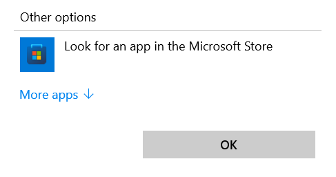
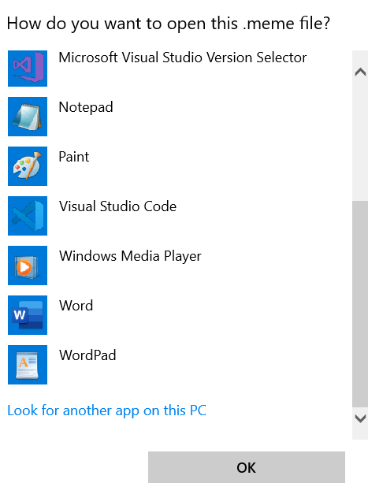

# ChallengePixels

Challenge yourself to unlock premium images. We've all encountered stock image apps that claim to be "FREE" but require you to sign up for unnecessary services or pay hidden fees. ChallengePixels is a truly free stock image app with a twist: you earn the images you want.

## Installation Locally

1. Clone the repository:
    ```bash
    git clone https://github.com/adityakotha03/meme.git
    ```

2. Navigate to the project directory:
    ```bash
    cd meme
    ```

3. Install the dependencies:
    ```bash
    npm install
    ```

4. Start the application:
    ```bash
    npm start
    ```

## How to Use the .meme Files

1. Navigate to the Python directory:
    ```bash
    cd Python
    ```

2. Ensure you have Python 3.7 or greater installed.

3. Install the required Python packages:
    ```bash
    pip install Pillow pygame pyinstaller
    ```

4. To create an executable file, run:
    ```bash
    pyinstaller --onefile meme_handler.py
    ```

### Using the .meme Files on Windows

1. Double-click on a `.meme` file using your File Explorer.
2. Click on **More Apps** (see image below).

   

3. Click on **Look for another app on this PC** (see image below).

   

4. Navigate to the directory where you cloned the repository. Inside the `Python` folder, open the `dist` directory and select `meme_handler.exe`.

    > **Note:** The `dist` folder is created after you run `pyinstaller --onefile meme_handler.py`.

### Using the .meme Files on Mac or Linux

For Mac or Linux users, you can use the `meme.py` script located inside the `Python` folder. This script provides functions for encoding and decoding images, allowing you to access the `.meme` files.

We have also provided a sample image inside the `Python/sample` directory for you to try out.

---

Feel free to reach out if you encounter any issues or have any questions in the [Discussions](https://github.com/adityakotha03/meme/discussions)!